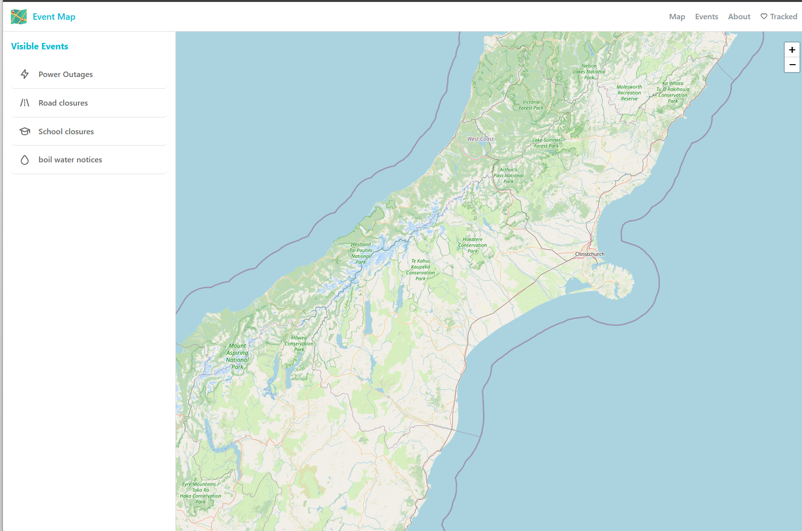
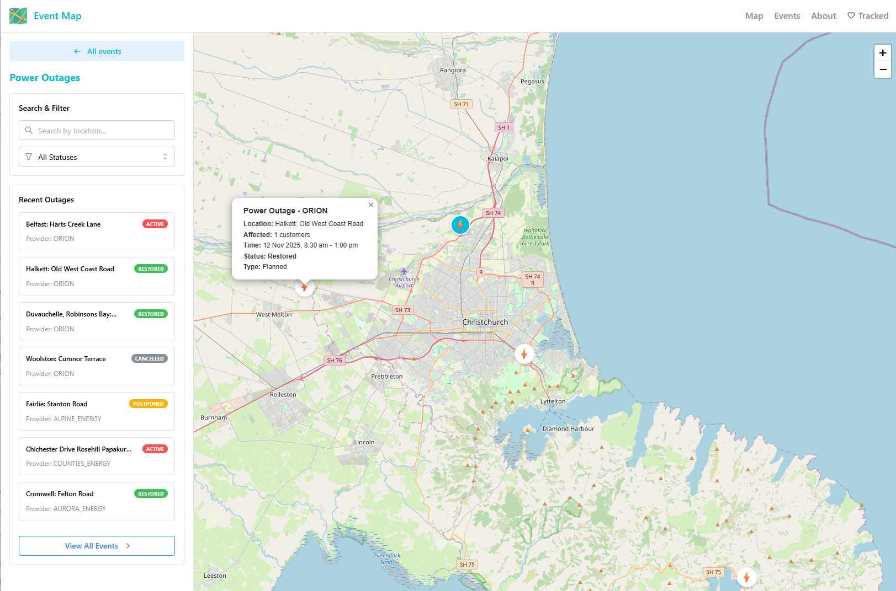
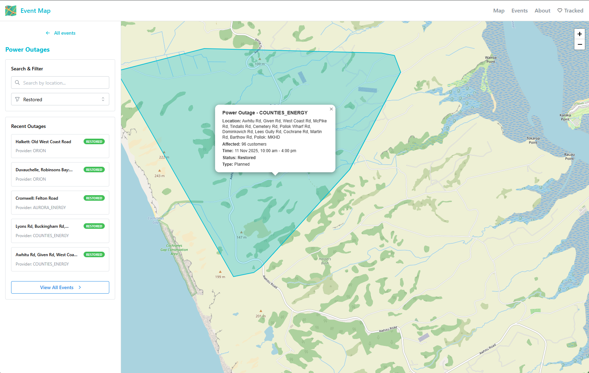
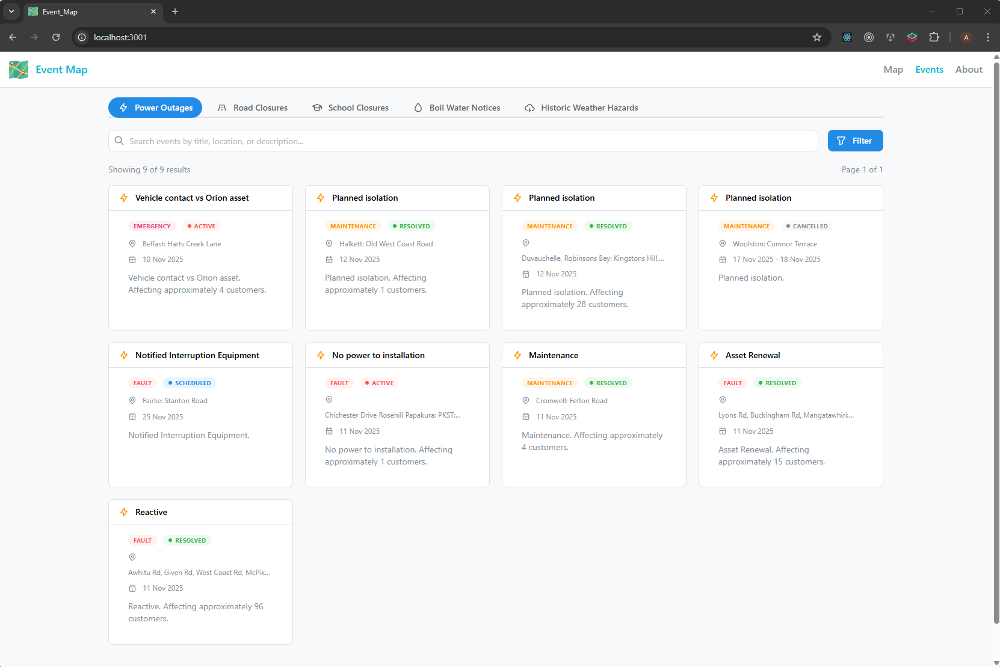

# Utility Outages Map

Real-time tracking and visualization of utility outages across New Zealand. This platform aggregates power outages from 28+ electricity providers and road events from NZTA into a unified, interactive map interface.

**Live Demo:** [https://event-map-frontend.vercel.app/](https://event-map-frontend.vercel.app/)

## Screenshots

### Home Page


### Power Outage View


### Polygon Area Display


### Event Search Page


---

## Table of Contents

- [Overview](#overview)
- [Architecture](#architecture)
- [Project Structure](#project-structure)
- [Tech Stack](#tech-stack)
- [Prerequisites](#prerequisites)
- [Getting Started](#getting-started)
- [Services](#services)
- [API Documentation](#api-documentation)
- [Data Sources](#data-sources)
- [Development](#development)
- [Docker Deployment](#docker-deployment)
- [Monitoring](#monitoring)
- [Roadmap](#roadmap)
- [Contributing](#contributing)

---

## Overview

The Utility Outages Map is a comprehensive monitoring platform that provides New Zealand residents with real-time information about service disruptions. The system collects data from multiple sources, stores it in a geospatial database, and presents it through an interactive web interface.

### Key Features

- Interactive map centered on New Zealand with pan, zoom, and marker clustering
- Real-time power outage data from 28+ electricity providers
- Road closure and traffic event data from NZTA
- Filtering by status, region, provider, and date range
- Responsive design for mobile, tablet, and desktop
- RESTful API with OpenAPI/Swagger documentation
- Grafana dashboards for monitoring and analytics
- Full Docker Compose deployment support

---

## Architecture

The system follows a monorepo architecture with three core services sharing a common database package:

```
┌─────────────────────────────────────────────────────────────────────────┐
│                              Frontend                                    │
│                    React + TypeScript + Leaflet                         │
│                         (apps/web)                                       │
└─────────────────────────────────────────────────────────────────────────┘
                                    │
                                    ▼
┌─────────────────────────────────────────────────────────────────────────┐
│                              REST API                                    │
│                    Robyn + SQLAlchemy + GeoAlchemy2                      │
│                         (apps/api)                                       │
└─────────────────────────────────────────────────────────────────────────┘
                                    │
                                    ▼
┌─────────────────────────────────────────────────────────────────────────┐
│                         TimescaleDB + PostGIS                            │
│                      (Geospatial Time-Series DB)                         │
└─────────────────────────────────────────────────────────────────────────┘
                                    ▲
                                    │
┌─────────────────────────────────────────────────────────────────────────┐
│                           Data Scraper                                   │
│                    Python + httpx + Polars + Shapely                     │
│                        (apps/scraper)                                    │
└─────────────────────────────────────────────────────────────────────────┘
```

### Data Flow

1. **Scraper** fetches outage data from provider APIs hourly
2. **Database** stores events with geospatial data (points, polygons, multilines)
3. **API** serves filtered data as GeoJSON to the frontend
4. **Frontend** renders events on an interactive Leaflet map

---

## Project Structure

```
utility-outage-monorepo/
├── apps/
│   ├── api/                    # REST API service
│   │   ├── src/
│   │   │   ├── main.py         # Robyn app entry point
│   │   │   ├── routes.py       # API route handlers
│   │   │   ├── schemas.py      # Pydantic schemas
│   │   │   └── database.py     # Database session management
│   │   ├── Dockerfile
│   │   └── pyproject.toml
│   │
│   ├── scraper/                # Data collection service
│   │   ├── src/
│   │   │   ├── jobs/
│   │   │   │   └── fetcher.py  # Main scraping orchestrator
│   │   │   ├── routes/
│   │   │   │   ├── power/      # 28+ power provider scrapers
│   │   │   │   └── roads/      # NZTA road event scraper
│   │   │   ├── database/
│   │   │   │   └── init.sql    # Database initialization
│   │   │   └── utils/          # Shared utilities
│   │   ├── Dockerfile
│   │   └── pyproject.toml
│   │
│   └── web/                    # Frontend application
│       ├── src/
│       │   ├── components/     # React components
│       │   │   ├── MapView.tsx         # Power outage map
│       │   │   ├── MapViewRoad.tsx     # Road closure map
│       │   │   ├── HazardsView.tsx     # Weather hazards map
│       │   │   ├── Sidebar*.tsx        # Sidebar components
│       │   │   └── shared/             # Reusable components
│       │   ├── stores/         # Zustand state management
│       │   ├── services/       # API client services
│       │   ├── types/          # TypeScript interfaces
│       │   ├── hooks/          # Custom React hooks
│       │   └── utils/          # Utility functions
│       ├── Dockerfile
│       └── package.json
│
├── packages/
│   └── db/                     # Shared database package
│       └── db/
│           ├── models.py       # SQLAlchemy models (PowerOutage, RoadEvent)
│           └── database.py     # Connection management
│
├── grafana/                    # Monitoring dashboards
│   ├── dashboards/
│   │   ├── power-outages.json
│   │   └── road-closures.json
│   └── provisioning/
│
├── docker-compose.yml          # Full stack deployment
├── turbo.json                  # Turborepo configuration
└── package.json                # Monorepo workspace config
```

---

## Tech Stack

### Backend (Python)

| Component | Technology | Purpose |
|-----------|------------|---------|
| API Framework | [Robyn](https://github.com/sparckles/robyn) | High-performance async Python web framework |
| ORM | [SQLAlchemy 2.0](https://www.sqlalchemy.org/) | Database abstraction and query building |
| Geospatial | [GeoAlchemy2](https://geoalchemy-2.readthedocs.io/) | PostGIS integration for SQLAlchemy |
| HTTP Client | [httpx](https://www.python-httpx.org/) | Async HTTP requests for scraping |
| Data Processing | [Polars](https://pola.rs/) | Fast DataFrame operations |
| Geometry | [Shapely](https://shapely.readthedocs.io/) | Geometric object manipulation |
| Validation | [Pydantic](https://docs.pydantic.dev/) | Data validation and serialization |
| Package Manager | [uv](https://docs.astral.sh/uv/) | Fast Python package management |

### Frontend (TypeScript)

| Component | Technology | Purpose |
|-----------|------------|---------|
| Framework | [React 19](https://react.dev/) | UI component library |
| Build Tool | [Vite](https://vitejs.dev/) | Fast development and bundling |
| UI Library | [Mantine UI](https://mantine.dev/) | Component library and hooks |
| Mapping | [Leaflet](https://leafletjs.com/) + [React Leaflet](https://react-leaflet.js.org/) | Interactive maps |
| State | [Zustand](https://zustand-demo.pmnd.rs/) | Lightweight state management |
| HTTP Client | [Axios](https://axios-http.com/) | API requests |
| Icons | [Tabler Icons](https://tabler.io/icons) | Icon library |

### Infrastructure

| Component | Technology | Purpose |
|-----------|------------|---------|
| Database | [TimescaleDB](https://www.timescale.com/) + [PostGIS](https://postgis.net/) | Time-series geospatial database |
| Monitoring | [Grafana](https://grafana.com/) | Dashboards and visualization |
| Containerization | [Docker](https://www.docker.com/) | Service containerization |
| Orchestration | [Docker Compose](https://docs.docker.com/compose/) | Multi-container deployment |
| Monorepo | [Turborepo](https://turbo.build/) | Build system and task runner |
| Package Manager | [Bun](https://bun.sh/) | JavaScript runtime and package manager |

---

## Prerequisites

Before getting started, ensure you have the following installed:

- **[Bun](https://bun.sh/)** (v1.2+) - JavaScript runtime and package manager
- **[uv](https://docs.astral.sh/uv/)** - Python package and project manager
- **[Docker](https://docs.docker.com/get-docker/)** - Container runtime
- **[Docker Compose](https://docs.docker.com/compose/install/)** - Multi-container orchestration
- **Python 3.12+** - For running Python services locally
- **Node.js 20+** - For frontend development (if not using Bun)

---

## Getting Started

### 1. Clone the Repository

```bash
git clone https://github.com/archerzou/utility-outages.git
cd utility-outages
```

### 2. Environment Configuration

Create a `.env` file in the root directory:

```bash
cp .env.example .env
```

Edit `.env` with your configuration:

```env
# Database Configuration
POSTGRES_USER=user
POSTGRES_PASSWORD=password
POSTGRES_DB=outages

# Grafana Configuration
GF_SECURITY_ADMIN_USER=admin
GF_SECURITY_ADMIN_PASSWORD=admin
```

For the web frontend, create `apps/web/.env`:

```bash
cp apps/web/.env.example apps/web/.env
```

```env
# API Configuration
VITE_API_BASE_URL=http://localhost:8081

# Map Defaults (Wellington, NZ)
VITE_DEFAULT_MAP_CENTER_LAT=-41.2924
VITE_DEFAULT_MAP_CENTER_LNG=174.7787
VITE_DEFAULT_MAP_ZOOM=6
```

### 3. Install Dependencies

```bash
# Install all workspace dependencies
bun install
```

### 4. Start Infrastructure

Start the database, Grafana, and scraper services:

```bash
docker compose up -d --build
```

This starts:
- **TimescaleDB** on port `5433`
- **Grafana** on port `3000`
- **Scraper** (background data collection)
- **API** on port `8081`
- **Web** on port `3001`

### 5. Local Development

For faster development iteration, run the API and web frontend natively:

```bash
# Run all services concurrently
bun run dev
```

Or run individual services:

```bash
# API only
cd apps/api
uv run python src/main.py

# Web frontend only
cd apps/web
bun run dev
```

### 6. Access the Application

| Service | URL | Description |
|---------|-----|-------------|
| Web Frontend | http://localhost:5173 | Interactive map (dev mode) |
| Web Frontend | http://localhost:3001 | Interactive map (Docker) |
| API | http://localhost:8081 | REST API |
| API Docs | http://localhost:8081/docs | Swagger UI |
| Grafana | http://localhost:3000 | Monitoring dashboards |

---

## Services

| Service | Port | Description |
|---------|------|-------------|
| **Web** | `5173` (dev) / `3001` (Docker) | React frontend with interactive map |
| **API** | `8081` | Robyn REST API serving GeoJSON data |
| **Database** | `5433` | TimescaleDB with PostGIS extension |
| **Grafana** | `3000` | Monitoring and visualization dashboards |
| **Scraper** | `8080` (internal) | Background data collection service |

---

## API Documentation

The API provides RESTful endpoints for accessing outage data. Full interactive documentation is available via Swagger UI at [http://localhost:8081/docs](http://localhost:8081/docs).

### Endpoints

#### Get Outages
```
GET /api/v1/outages
```

Query parameters:
- `types` - Comma-separated list: `power`, `road` (default: `power,road`)
- `status` - Filter by status: `Active`, `Restored`, `Cancelled`, `All` (default: `Active`)
- `region` - Filter by region name
- `provider` - Filter by provider name
- `start_time` - ISO 8601 datetime (e.g., `2024-01-01T00:00:00Z`)
- `end_time` - ISO 8601 datetime
- `limit` - Results per page (default: 1000, max: 5000)
- `offset` - Pagination offset

Example:
```bash
# Get active power outages in Canterbury
curl "http://localhost:8081/api/v1/outages?types=power&status=Active&region=Canterbury"
```

#### Get Statistics
```
GET /api/v1/stats
```

Returns aggregate statistics for active outages grouped by type.

#### Get Providers
```
GET /api/v1/providers
```

Returns lists of available power and road event providers.

#### Get Regions
```
GET /api/v1/regions
```

Returns lists of regions with outage data.

### Response Format

```json
{
  "outages": [
    {
      "id": "mainpower-12345",
      "provider": "MainPower",
      "type": "power",
      "start_time": "2024-01-15T08:00:00+13:00",
      "end_time": "2024-01-15T16:00:00+13:00",
      "status": "Active",
      "category": "Unplanned",
      "location": "123 Main Street, Rangiora",
      "region": "Canterbury",
      "affected_customers": 250,
      "geometry": {
        "type": "Point",
        "coordinates": [172.5, -43.3]
      }
    }
  ]
}
```

---

## Data Sources

### Power Outage Providers (28+)

The scraper collects data from the following New Zealand electricity providers:

| Provider | Region | Provider | Region |
|----------|--------|----------|--------|
| Alpine Energy | Canterbury | Northpower | Northland |
| Aurora Energy | Otago | Orion | Canterbury |
| Buller Electricity | West Coast | Pioneer Energy | Otago |
| Counties Energy | Waikato | Powerco | Multiple |
| EA Networks | Canterbury | PowerNet | Southland |
| Electra | Horowhenua | ScanPower | Hawke's Bay |
| FirstLight | Gisborne | Top Energy | Far North |
| Horizon Energy | Bay of Plenty | Unison | Hawke's Bay |
| KCE | Kapiti | Vector | Auckland |
| Lines Company | King Country | Waipa Networks | Waikato |
| MainPower | Canterbury | WEL Networks | Waikato |
| Marlborough Lines | Marlborough | Welectricity | Wellington |
| Network Waitaki | Waitaki | Westpower | West Coast |
| Nelson Electricity | Nelson | | |

### Road Events

- **NZTA (Waka Kotahi)** - New Zealand Transport Agency road closures, roadworks, and traffic events

---

## Development

### Running Tests

```bash
# Run all tests
bun run test

# Run linting
bun run lint

# Format code
bun run format
```

### Adding a New Power Provider

1. Create a new file in `apps/scraper/src/routes/power/`:

```python
# apps/scraper/src/routes/power/newprovider.py
from src.routes.power import PowerClient

class NewProvider(PowerClient):
    name = "NewProvider"
    base_url = "https://api.newprovider.co.nz"
    
    async def fetch_outages(self):
        # Implement data fetching logic
        pass
```

2. Register the provider in `apps/scraper/src/routes/power/__init__.py`

3. Run the scraper to test:

```bash
cd apps/scraper
uv run python -m src.jobs.fetcher
```

### Database Migrations

The database schema is managed through SQLAlchemy models in `packages/db/db/models.py`. To apply schema changes:

1. Update the models
2. Restart the scraper service (it will create tables on startup)

For production, consider using Alembic for proper migrations.

---

## Docker Deployment

### Full Stack Deployment

Deploy all services with Docker Compose:

```bash
# Build and start all services
docker compose up -d --build

# View logs
docker compose logs -f

# Stop all services
docker compose down
```

### Individual Service Deployment

Build and run individual services:

```bash
# Build API
docker build -f apps/api/Dockerfile -t utility-outage-api .

# Build Web
docker build -f apps/web/Dockerfile -t utility-outage-web \
  --build-arg VITE_API_BASE_URL=https://your-api-url.com .

# Build Scraper
docker build -f apps/scraper/Dockerfile -t utility-outage-scraper .
```

### Production Considerations

For production deployment:

1. Use proper secrets management (not `.env` files)
2. Configure SSL/TLS termination
3. Set up database backups
4. Configure proper logging and monitoring
5. Use a reverse proxy (nginx, Traefik) for the frontend
6. Consider using Kubernetes for orchestration at scale

---

## Monitoring

### Grafana Dashboards

Access Grafana at [http://localhost:3000](http://localhost:3000) with the credentials from your `.env` file.

Pre-configured dashboards:
- **Power Outages** - Active outages, affected customers, regional breakdown
- **Road Closures** - Active road events, event types, impact levels

### Scraper Logs

View scraper logs:

```bash
docker compose logs -f python-app
```

Or check the log file:

```bash
docker compose exec python-app cat fetcher.log
```

---

## Roadmap

### Completed

- [x] TimescaleDB & PostGIS integration
- [x] Electricity outages (28+ providers)
- [x] Road closures (NZTA)
- [x] Scraper scheduling (hourly)
- [x] Grafana dashboards
- [x] REST API with OpenAPI docs
- [x] Interactive web map
- [x] Docker Compose deployment

### Planned

- [ ] Boil water notices
- [ ] School closures
- [ ] Telco outages
- [ ] Push notifications
- [ ] Historical data analysis
- [ ] Mobile app (React Native)

---


## License

MIT License - see [LICENSE](LICENSE) for details.
